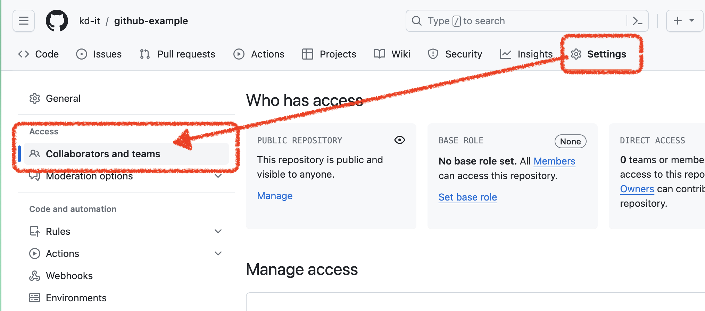
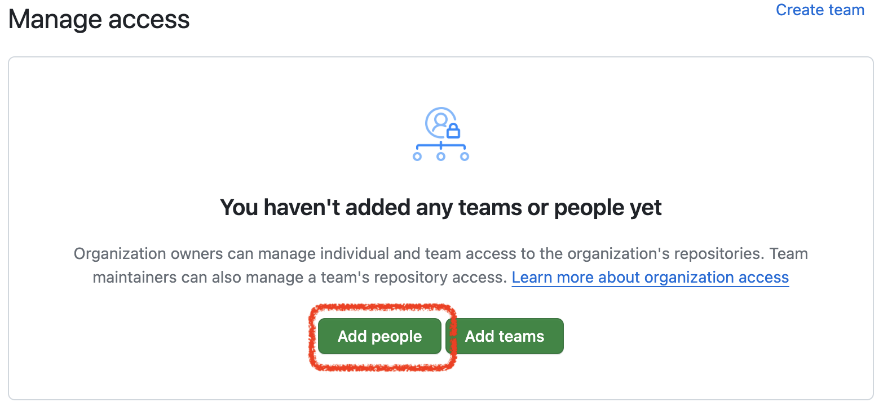
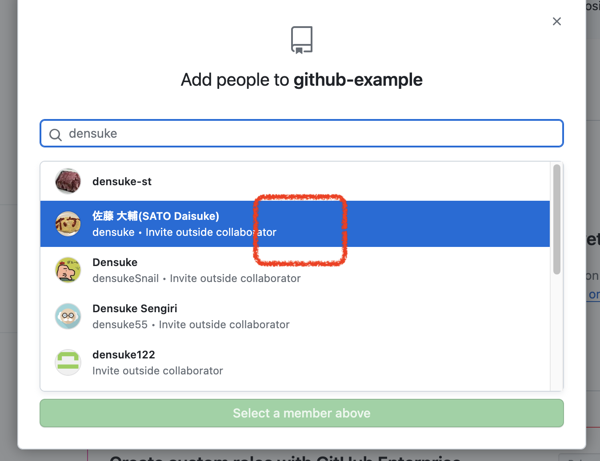
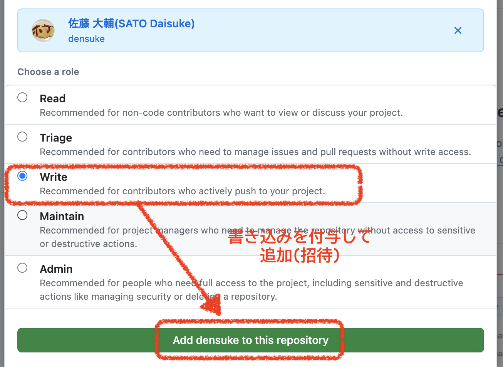
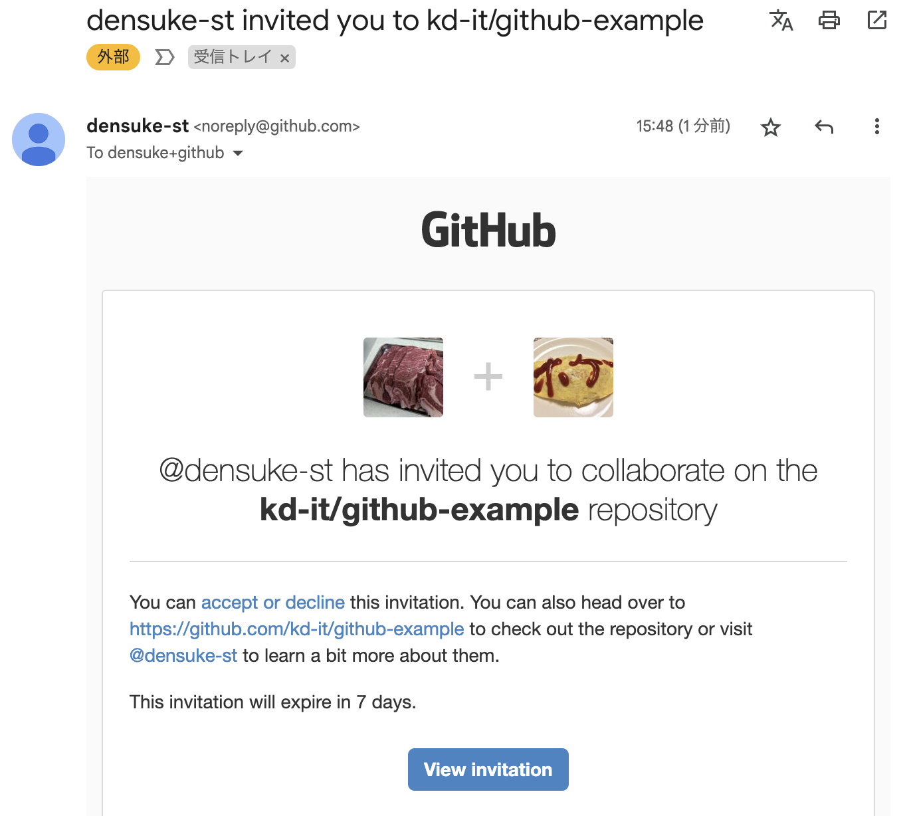

# GitHubの練習用リポジトリ(大元)

以下の手順で環境を作って下さい。
まずは一番苦行になるものをやってみます。

1. 代表の方はこのリポジトリをforkしてください
2. forkしたリポジトリの設定で、コラボレーターを設定してください
    1. forkしたリポジトリ(のWebサイト)に接続する
    2. `Settings` > `Collabolators and teams` と進む
        
    3. `Add People` のボタンで設定画面へ
        
    4. メンバーのGitHubユーザー名を入れて検索、該当ユーザーを選んで進める
        
    5. 権限を付与、ここではWriteをチェックしてから追加(招待)
        
    6. これを必要な人数分行ってください
3. メンバーは代表からの招待メールが届くので受信して受け入れを行ってください
    

以上により、本リポジトリにメンバー全員のアクセス権が付与されるので、共同で使えるようになります。

アクセスできるようになったらリポジトリのアドレスを取得して、各自の環境でGit Cloneしてリポジトリのクローンをローカルで作成してください。

※ 間違ってもマスターとなっている本リポジトリを使わないで下さいね
